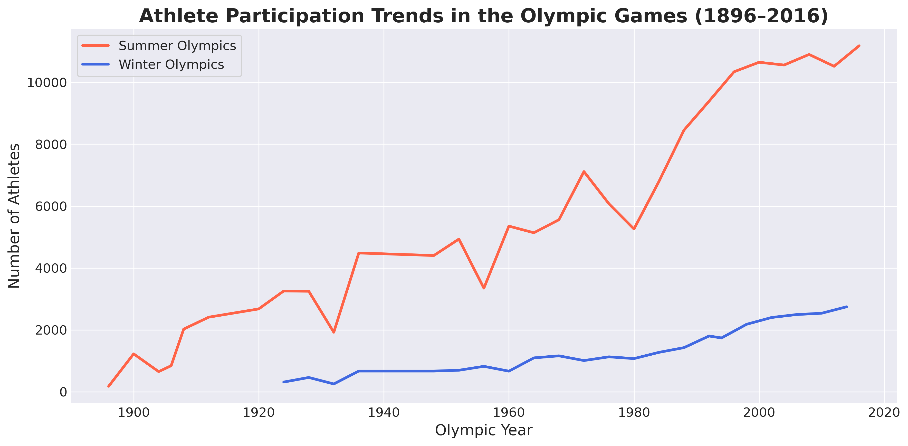
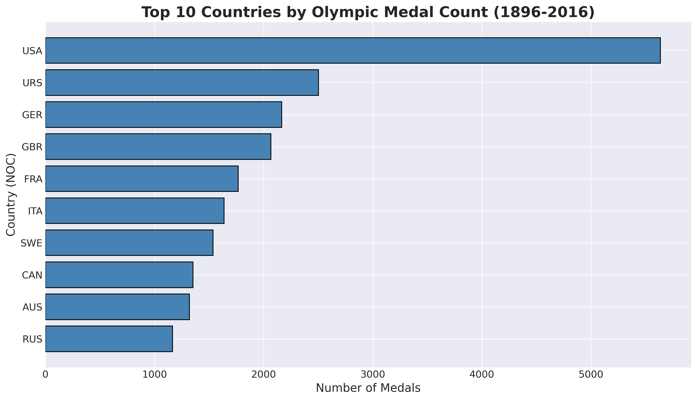
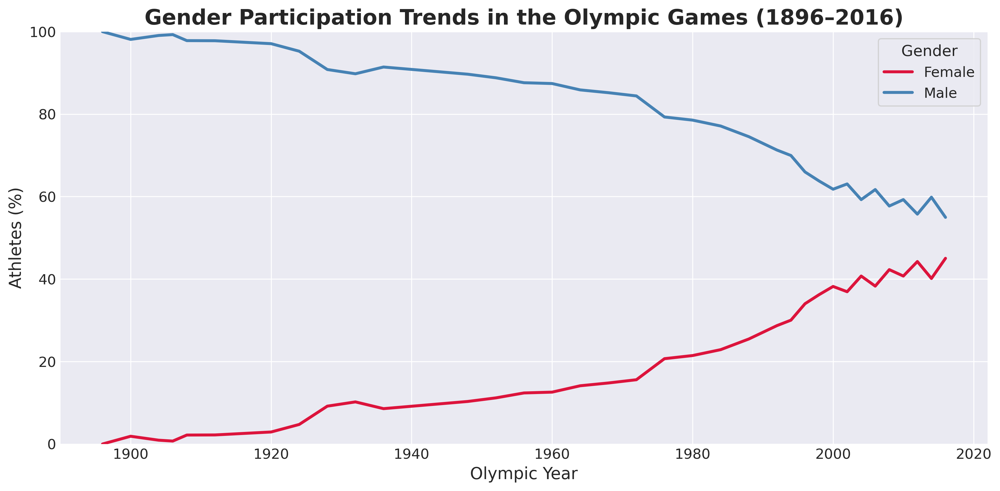
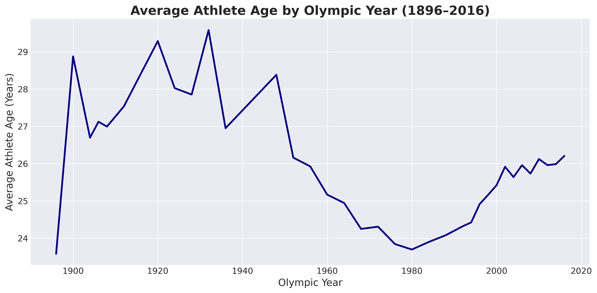

# Olympic Medal Analysis (1896–2016)


A data analysis project exploring more than 120 years of Olympic history using **Python**, **Pandas**, and **Matplotlib**. This project investigates participation trends, medal distribution, gender representation, and athlete characteristics through exploratory data analysis (EDA).

---

## Table of Contents

- [Overview](#overview)
- [Objectives](#objectives)
- [Dataset](#dataset)
- [Technologies](#technologies)
- [Project Structure](#project-structure)
- [Data Cleaning](#data-cleaning)
- [Exploratory Data Analysis](#exploratory-data-analysis)
- [Results](#results)
- [Visualisations](#visualisations)
- [Repository Structure](#repository-structure)
- [How to Run](#how-to-run)
- [Skills Demonstrated](#skills-demonstrated)
- [Future Improvements](#future-improvements)
- [Author](#author)
- [License](#license)

---

## Overview

The Olympic Games provide one of the largest publicly available sports datasets. This project analyses athlete-level Olympic records from **1896 to 2016** to identify long-term trends in participation, medal success, and demographic characteristics.

The project demonstrates practical skills in:

- Data cleaning
- Exploratory Data Analysis (EDA)
- Data visualisation
- Statistical summarisation
- Technical documentation
- Version control with Git

---

## Objectives

This project answers the following research questions:

- How has Olympic participation changed over time?
- Which countries have won the most Olympic medals?
- Which sports award the largest number of medals?
- How has female participation changed throughout Olympic history?
- Which countries dominate selected Olympic sports?
- How have athlete ages changed across Olympic history?

---

## Dataset

**Dataset:** *120 Years of Olympic History: Athletes and Results*

The dataset contains athlete-level records from every Olympic Games between **1896 and 2016**.

### Dataset Summary

- Olympic Games: **1896–2016**
- National Olympic Committees (NOCs): **230**
- Sports: **66**
- Seasons:
  - Summer
  - Winter

Variables include:

- Athlete
- Sex
- Age
- Height
- Weight
- Team
- NOC
- Year
- Season
- City
- Sport
- Event
- Medal

---

## Technologies

- Python
- Pandas
- NumPy
- Matplotlib
- Jupyter Notebook
- Git
- GitHub

---

## Project Structure

```text
Olympic-Medal-Analysis/
│
├── data/
│   └── athlete_events.csv
│
├── notebooks/
│   └── analysis.ipynb
│
├── images/
│   ├── participation_trends.png
│   ├── top_countries.png
│   ├── top_sports.png
│   ├── gender_trends.png
│   ├── athletics.png
│   ├── swimming.png
│   ├── gymnastics.png
│   ├── rowing.png
│   ├── fencing.png
│   ├── average_age.png
│   ├── youngest_sports.png
│   └── oldest_sports.png
│
├── report/
│   └── Olympic_Medal_Report.pdf
│
├── README.md
├── requirements.txt
└── .gitignore
```

---

## Data Cleaning

Before analysis, the dataset was inspected to assess its quality.

The following steps were performed:

- Examined missing values
- Identified duplicate records
- Investigated extreme values in the numerical variables
- Verified the consistency of categorical variables
- Removed duplicate records from the working DataFrame to avoid duplicate counting during analysis

Missing values in the `Medal` column were retained because they represent athletes who did not win medals rather than missing information. Missing values in `Age`, `Height`, and `Weight` were also preserved, as these variables were not required for every analysis.

---

## Exploratory Data Analysis

The following analyses were performed:

### Olympic Participation Trends

- Athlete participation over time
- National participation over time

### Country Performance

- Top medal-winning countries
- Medal distribution by country

### Sports Analysis

- Top medal-winning sports
- Medal distribution across sports

### Gender Analysis

- Male vs Female participation
- Historical gender trends

### Country Dominance

- Athletics
- Swimming
- Gymnastics
- Rowing
- Fencing

### Athlete Characteristics

- Average athlete age by Olympic year
- Youngest sports
- Oldest sports

---

## Results

Key findings include:

- Olympic participation increased substantially between 1896 and 2016.
- Female participation grew consistently throughout Olympic history.
- Medal success is concentrated among a relatively small number of countries.
- Sports vary considerably in their contribution to total medal counts.
- Several countries exhibit long-term dominance in specific sports.
- Athlete age differs significantly between sporting disciplines.

---

## Visualisations

### Participation Trends



### Top Medal-Winning Countries



### Gender Participation Trends



### Average Athlete Age



> Additional figures are available in the `images/` directory and the accompanying report.

---

## Repository Structure

| File | Description |
|------|-------------|
| `analysis.ipynb` | Main notebook containing the complete analysis |
| `athlete_events.csv` | Original Olympic dataset |
| `Olympic_Medal_Report.pdf` | Full project report |
| `README.md` | Project documentation |

---

## How to Run

Clone the repository:

```bash
git clone https://github.com/elinavt/Olympic-Medal-Analysis.git
```

Navigate to the project:

```bash
cd Olympic-Medal-Analysis
```

Install the required packages:

```bash
pip install -r requirements.txt
```

Launch Jupyter Notebook:

```bash
jupyter notebook notebooks/analysis.ipynb
```

---

## Skills Demonstrated

- Python programming
- Data cleaning
- Exploratory Data Analysis (EDA)
- Data visualisation
- Data aggregation
- Statistical summaries
- Technical documentation
- Git version control
- GitHub workflow

---

## Future Improvements

Possible future extensions include:

- Interactive dashboards using Streamlit
- Plotly visualisations
- Statistical hypothesis testing
- Medal analysis normalised by population or GDP
- Machine learning for medal prediction
- Analysis of Olympic Games beyond 2016

---

## Author

**Elina Vatanizadeh**

Programming & Data Science Portfolio

GitHub: https://github.com/elinavt

---

## License

This project is licensed under the MIT License.

---

## Acknowledgements

- Kaggle — *120 Years of Olympic History: Athletes and Results*
- Python Documentation
- Pandas Documentation
- Matplotlib Documentation
